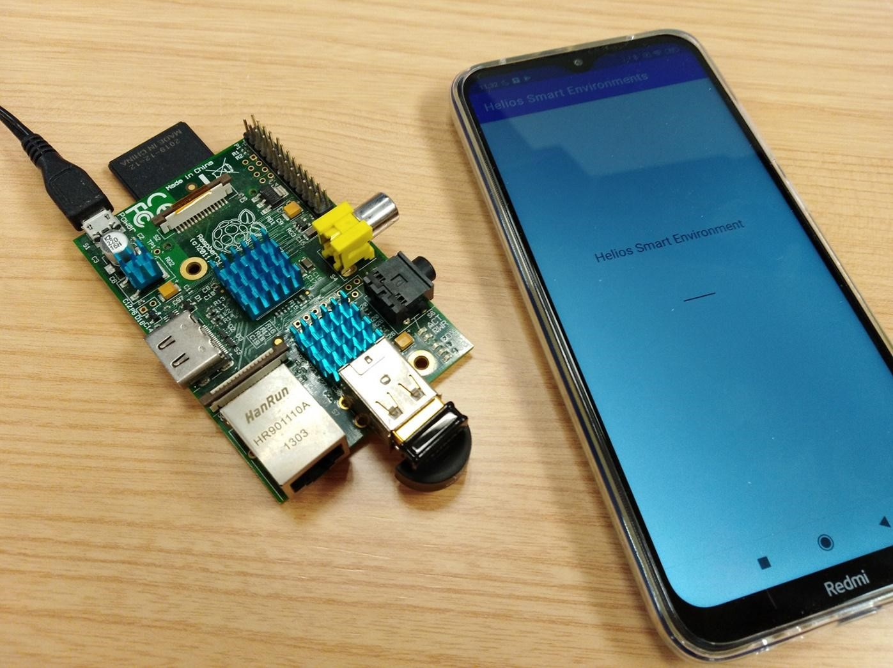
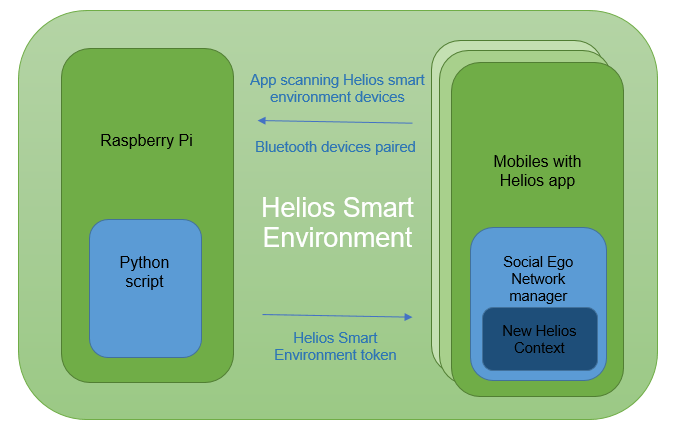

# Helios Smart Environments with Bluetooth connection

In order to create a Smart Environment via Bluetooth connection, we need a hardware component with capability to execute a script and detect Bluetooth connections. For our tests, we choice the Raspberry Pi.

We used the model 2011.12, with 512 MB RAM and an ARM1176JZF-S processor at 700 MHz.

Raspberry Pi used in tests incorporates Raspbian GNU / Linux 10 OS and a set of Python libraries to configure Bluetooth connections:

```python
import os
import glob
import time
import RPi.GPIO as GPIO
from bluetooth import *
```

we designed an approach with following requeriments:

### Raspberry Pi with Bluetooth configuration

●	Bluetooth device name: Helios environment 01

●	Running Python script to scan incoming requests of other devices.

### Android devices with Helios app

●	Development of an Android module to scan Helios Smart Environments

●	Utility to connect with the environment, using a token to autenticate Helios element

●	Calls to Social Ego Network Manager to create a new context for connected users



# General architecture




### Android module functionalities

●	Checking location and Bluetooth permissions on mobile device

●	Scan Bluetooth devices

●	Detect if discovered device is an Helios Smart Envrionment component

●	Implementation of an Android Service to manage Bluetooth connection

●	Call to Social Ego Network manager to create a new Helios Context

### Raspberry device functionalities

●	Python script running a RFCOMM server 

●	Service waiting for a Bluetooth connection

●	Implementation using Python classes:

        RPi
        bluetooth
        pybluez

