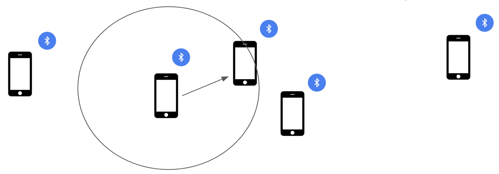
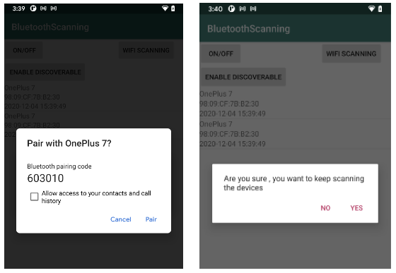

# HeliosSmartEnvironments: Organic Social Graph (T 4.7)

An important use case of the [Helios](https://helios-h2020.eu/) project is making meaningful social connections among people. Considering mobile devices as the representatives of the users, it may be possible to learn the pattern of a user's daily activities based on the data generated by a number of sensors (such as Accelerometer, Gyroscope, Barometer, Ambient light sensor, Rotation etc.) present on the user's mobile device.

This Android project implements the concept of an organic social graph based on mobile phone sensors. In particular we make use of Bluetooth to find all the Bluetooth devices in close proximity.

<!--  -->


The app installed in a mobile device keeps track of all nearby Bluetooth devices. The app automatically sends a connection request to another mobile device if they frequently appear in each other's close proximity. Once the connection request is accepted, two users become friends and they make a social graph of two nodes. We call this an organic social graph, which keeps expanding over time.

The users who frequently appear in each other’s close proximity (e.g. in a cafe, in office, or in a movie hall) may have a similar activity pattern, and may be interested to connect to each other.
This implementation provides the initial structure of a social graph which may be used for further research in creating more meaningful, and personalized connections by learning users' interests, and other contextual information such as time, location, purpose etc.
This project can be used either as a stand-alone application (APK) or as a library (AAR). More information on how to create a library module (AAR), and how to use that module as a dependency, can be found [here](https://developer.android.com/studio/projects/android-library).

# Implementing an Organic Social Network based on Bluetooth

To listen to the Bluetooth turning on/off we have a broadcast receiver called `bluetoothStateBroadcastReceiver`.

```java
private final BroadcastReceiver bluetoothStateBroadcastReceiver = new BroadcastReceiver() {
   public void onReceive(Context context, Intent intent) {
       String action = intent.getAction();
       if (action.equals(mBluetoothAdapter.ACTION_STATE_CHANGED)) {
           final int state = intent.getIntExtra(BluetoothAdapter.EXTRA_STATE, mBluetoothAdapter.ERROR);

           switch (state) {
               case BluetoothAdapter.STATE_OFF:
                  stopRepeatingTask();
                   Log.d(TAG, "onReceive: STATE OFF");
               case BluetoothAdapter.STATE_TURNING_OFF:
                   Log.d(TAG, "onReceive: STATE TURNING OFF");
               case BluetoothAdapter.STATE_ON:
                  startRepeatingTask();
                   Log.d(TAG, "onReceive: STATE ON");
               case BluetoothAdapter.STATE_TURNING_ON:
                   Log.d(TAG, "onReceive: STATE TURNING ON");
           }
       }
   }
};
```

On getting `BluetoothAdapter.STATE_ON`, `startRepeatingTask()` is called, which eventually calls a thread to start the scanning for every 15 minutes by calling discoverUnpairedDevices broadcast receiver and prints the result of the scanning in the listview.

```java
public final BroadcastReceiver discoverUnpairedDevices = new BroadcastReceiver() {
   @RequiresApi(api = Build.VERSION_CODES.KITKAT)
   public void onReceive(Context context, Intent intent) {

       final String action = intent.getAction();
       Log.d(TAG, "OnReceive: Action found");
       if (action.equals(BluetoothDevice.ACTION_FOUND)) {

           BluetoothDevice bluetoothDevice = intent.getParcelableExtra(BluetoothDevice.EXTRA_DEVICE);
           rssi = intent.getShortExtra(BluetoothDevice.EXTRA_RSSI, Short.MIN_VALUE);

           @SuppressLint("SimpleDateFormat") SimpleDateFormat dateFormat = new SimpleDateFormat("yyyy-MM-dd HH:mm:ss");
           currentDateTime = dateFormat.format(new Date());
           BluetoothClass bluetoothClass = bluetoothDevice.getBluetoothClass();
           if (bluetoothClass.getDeviceClass() == BluetoothClass.Device.PHONE_SMART) {...}
           Log.d(TAG, "OnReceive:" + bluetoothDevice.getName() + " " + bluetoothDevice.getAddress() + "" + rssi);
           mDeviceListAdapter = new DeviceListAdapter(context, R.layout.device_adapter_view, mBTDevices, rssi);
           lvNewDevices.setAdapter(mDeviceListAdapter);
       }
   }
};
```

While scanning a Bluetooth device, four values from the device are received which are its MAC address, RSSI value, timestamp, and variable frequency (the number of times the same address comes in proximity). The values are copied into a text file in the external storage which is accessible at Android/data/com.packagename.com/files/BluetoothScanned.txt.

For copying the data, the method `WriteBtn(bluetoothDevice.getAddress(), rssi, currentDateTime, frequncy)` is called.

```java
@RequiresApi(api = Build.VERSION_CODES.KITKAT)
public void WriteBtn(String address, int rssi, String currentDateTime, int frequncy,String addressValue) {
   try {
           File file = new File(this.getExternalFilesDir(null), "BluetoothScannedDevice.txt");
           FileOutputStream fileOutput = new FileOutputStream(file, true);
           OutputStreamWriter outputStreamWriter = new OutputStreamWriter(fileOutput);
           outputStreamWriter.write("Address : " + address);
           outputStreamWriter.append(" , ");
           outputStreamWriter.write("DB :" + rssi);
           outputStreamWriter.append(" , ");
           outputStreamWriter.write("TimeStamp:" + currentDateTime);
           outputStreamWriter.append(" , ");
           outputStreamWriter.write("Frequency:" + frequncy);
           outputStreamWriter.write("\n\n");
           outputStreamWriter.write("Location:" + addressValue);
           outputStreamWriter.write("\n\n");
           outputStreamWriter.flush();
           fileOutput.getFD().sync();
           outputStreamWriter.close();
           MediaScannerConnection.scanFile(this, new String[]{file.getAbsolutePath()}, null, null);
       }
       catch (Exception e) {
            e.printStackTrace();
       }
}
```

To make the device discoverable, a different broadcast receiver `bluetoothDiscoverableBroadcastReceiver` is used. It makes the device's Bluetooth discoverable for 300 seconds for other devices to pair with the device.

```java
private final BroadcastReceiver bluetoothDiscoverableBroadcastReceiver = new BroadcastReceiver() {
   public void onReceive(Context context, Intent intent) {
       String action = intent.getAction();
       if (action.equals(mBluetoothAdapter.ACTION_SCAN_MODE_CHANGED)) {
           int mode = intent.getIntExtra(BluetoothAdapter.EXTRA_SCAN_MODE, mBluetoothAdapter.ERROR);

           switch (mode) {
               case BluetoothAdapter.SCAN_MODE_CONNECTABLE_DISCOVERABLE:
                   Log.d(TAG, "bluetoothDiscoverableBroadcastReceiver: Discoverable Enabled");
               case BluetoothAdapter.SCAN_MODE_CONNECTABLE:
                   Log.d(TAG, "bluetoothDiscoverableBroadcastReceiver: Discoverablity Enabled. Able to receive connections.");
               case BluetoothAdapter.SCAN_MODE_NONE:
                   Log.d(TAG, "bluetoothDiscoverableBroadcastReceiver: Discoverablity Disabled. Not Able to receive connections.");
               case BluetoothAdapter.STATE_CONNECTING:
                   Log.d(TAG, "bluetoothDiscoverableBroadcastReceiver:Connecting...");
               case BluetoothAdapter.STATE_CONNECTED:
                   Log.d(TAG, "bluetoothDiscoverableBroadcastReceiver:Connected...");
           }
       }
   }
};
```

# Pairing with Bluetooth devices

A smart pairing option is installed to keep track of the number of times a device is in close proximity. For this a collection class is used which increments the variable `frequncy` if it was previously scanned and available in the list.

```java
if(mBTDevices.contains(bluetoothDevice) && maddressValue.contains(addressValue)) {
   frequncy= Collections.frequency(mBTDevices, bluetoothDevice);

   if(frequncy > 1) {
       mproximityBluetoothDevice.add(bluetoothDevice);
       . . .
       Node user2= cen.getOrCreateNode("user-0002",currentDateTime);
       Node user3= cen.getOrCreateNode("user-0003",currentDateTime);
       Node user4= cen.getOrCreateNode("user-0004",currentDateTime);
       eu.h2020.helios_social.core.contextualegonetwork.Context context1= cen.getOrCreateContext("Test context");
       context1.getOrAddEdge(user1,user2);
       context1.getOrAddEdge(user1,user3);
       context1.getOrAddEdge(user1,user4);
       cen.save();
       //activityTimer();
   }
  // chooserDialog();
}
```

After getting the connection state of the device, we initiate the pairing by calling `createBond(bluetoothDevice)` method, which prompts the user with a pairing request dialog box. In the dialog box, between two options, the user can either 'Cancel' the request or can 'Pair' with the device.

If the user chooses to pair, the device will get paired with the other device. In either case a dialog box asks if the device should scan again.

<!--  -->


Clicking on the 'Yes' button starts the scanning process again.

Note that once a connection is established, the information about the device is stored and managed by making use of the [Contextual Ego Network (CEN)](https://github.com/helios-h2020/h.core-SocialEgoNetwork) library. In particular, a Contextual Ego Network instance for an ego node with a CEN-specific local identifier say `user_00001` is created as follows:

```java
ContextualEgoNetwork cen = ContextualEgoNetwork.createOrLoad("", "user_00001", null);
Node user1 = cen.getEgo();
```

# Device Sensor Scanning

Device sensor scanning is used for the in-built sensors of the device such as accelerometer, gyrometer, gravity, temperature, magnetometer, barometer and light. To scan such sensors the sensor data is imported via the `SensorManager` class which provides sensors' data directly from the Android device.


```java
SensorManager sensorManager;
sensorManager=(SensorManager) getSystemService(Context.SENSOR_SERVICE);
assert sensorManager != null;
accelerometer= sensorManager.getDefaultSensor(Sensor.TYPE_ACCELEROMETER);
if(accelerometer!=null) {...}
else {...}
gyrometer= sensorManager.getDefaultSensor(Sensor.TYPE_GYROSCOPE);
if(gyrometer!=null) {...}
else {...}
magnometer= sensorManager.getDefaultSensor(Sensor.TYPE_MAGNETIC_FIELD);
if(magnometer!=null) {...}
else {...}
. . .
```

Since the sensors' data (say the rotation) keep updating every moment the phone changes its orientation, for instance, the following method is implemented to capture all the changes that a sensor goes through. It also copies the data in a separate file for each sensor.

```java
public void onSensorChanged(SensorEvent sensorEvent) {
   Sensor sensor= sensorEvent.sensor;
   @SuppressLint("SimpleDateFormat") SimpleDateFormat dateFormat = new SimpleDateFormat("yyyy-MM-dd HH:mm:ss");
   String currentDateTime = dateFormat.format(new Date());
   if(sensor.getType()==Sensor.TYPE_ACCELEROMETER){
       Log.d(TAG,"ACCELEROMETER " + "X:" + sensorEvent.values[0] + "Y:"+sensorEvent.values[1] + "Z:" +sensorEvent.values[2]);

     WriteSensorData("Accelerometer.txt",sensorEvent.values[0],sensorEvent.values[1],sensorEvent.values[2],currentDateTime);
   }
   else if(sensor.getType()==Sensor.TYPE_GYROSCOPE){
       Log.d(TAG,"GYROMETER " + "X:" + sensorEvent.values[0]+"Y:"+sensorEvent.values[1]+ "Z:" +sensorEvent.values[2]);

       WriteSensorData("Gyrometer.txt",sensorEvent.values[0],sensorEvent.values[1],sensorEvent.values[2],currentDateTime);
   }
. . .
}
```

The file location is the same as the "bluetoothScanned.txt" defined above.
